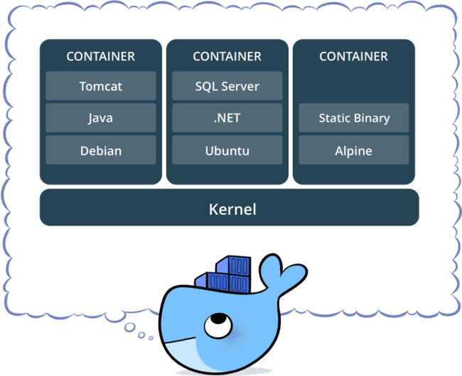
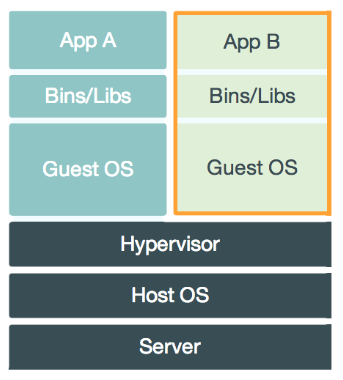
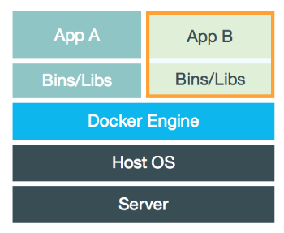

<!-- GFM-TOC -->
* [一、解决的问题](#一解决的问题)
* [二、与虚拟机的比较](#二与虚拟机的比较)
* [三、优势](#三优势)
* [四、使用场景](#四使用场景)
* [五、镜像与容器](#五镜像与容器)
* [六、Docker常用命令](#六Docker常用命令)
* [七、Docker使用Ubuntu](#七Docker使用Ubuntu)
* [参考资料](#参考资料)
<!-- GFM-TOC -->

  
 

# 一、解决的问题

由于不同的机器有不同的操作系统，以及不同的库和组件，在将一个应用部署到多台机器上需要进行大量的环境配置操作。

Docker 主要解决环境配置问题，它是一种虚拟化技术，对进程进行隔离，被隔离的进程独立于宿主操作系统和其它隔离的进程。使用 Docker 可以不修改应用程序代码，不需要开发人员学习特定环境下的技术，就能够将现有的应用程序部署在其他机器中。

# 二、与虚拟机的比较

虚拟机也是一种虚拟化技术，它与 Docker 最大的区别在于它是通过模拟硬件，并在硬件上安装操作系统来实现。

  
 

  
 

## 启动速度

启动虚拟机需要启动虚拟机的操作系统，再启动应用，这个过程非常慢；

而启动 Docker 相当于启动宿主操作系统上的一个进程。

## 占用资源

虚拟机是一个完整的操作系统，需要占用大量的磁盘、内存和 CPU，一台机器只能开启几十个的虚拟机。

而 Docker 只是一个进程，只需要将应用以及相关的组件打包，在运行时占用很少的资源，一台机器可以开启成千上万个 Docker。

# 三、优势

除了启动速度快以及占用资源少之外，Docker 具有以下优势：

## 更容易迁移

提供一致性的运行环境，可以在不同的机器上进行迁移，而不用担心环境变化导致无法运行。

## 更容易维护

使用分层技术和镜像，使得应用可以更容易复用重复部分。复用程度越高，维护工作也越容易。

## 更容易扩展

可以使用基础镜像进一步扩展得到新的镜像，并且官方和开源社区提供了大量的镜像，通过扩展这些镜像可以非常容易得到我们想要的镜像。

# 四、使用场景

## 持续集成

持续集成指的是频繁地将代码集成到主干上，这样能够更快地发现错误。

Docker 具有轻量级以及隔离性的特点，在将代码集成到一个 Docker 中不会对其它 Docker 产生影响。

## 提供可伸缩的云服务

根据应用的负载情况，可以很容易地增加或者减少 Docker。

## 搭建微服务架构

Docker 轻量级的特点使得它很适合用于部署、维护、组合微服务。

# 五、镜像与容器

镜像是一种静态的结构，可以看成面向对象里面的类，而容器是镜像的一个实例。

镜像包含着容器运行时所需要的代码以及其它组件，它是一种分层结构，每一层都是只读的（read-only layers）。构建镜像时，会一层一层构建，前一层是后一层的基础。镜像的这种分层存储结构很适合镜像的复用以及定制。

构建容器时，通过在镜像的基础上添加一个可写层（writable layer），用来保存着容器运行过程中的修改。

  
 

# 六、Docker常用命令

##### 获取镜像

docker pull ubuntu（默认最新版本） 或者 docker pull ubuntu:16.04

##### 查看镜像（列出所有镜像，显示信息，包括：容器ID等）

docker images

##### 搜索镜像

docker search mysql

##### 删除镜像

docker rmi ubuntu:16.04 或者 docker rmi 镜像ID

##### 创建镜像

docker commit -m "message"

##### 存出镜像（保存镜像到文件）

docker save -o ubuntu.tar ubuntu:16.04

##### 载入镜像

docker load < ubuntu.tar

##### 上传镜像

docker tag test:latest user/test:latest (添加新的标签user/test:latest）

docker push user/test:latest

##### 新建容器

docker create -ti ubuntu:latest （处于停止状态）

##### 查看所有容器（列出所有容器，显示信息，包括：容器ID等）

docker ps -a

##### 新建并启动容器

docker run -ti ubuntu:16.04 /bin/bash

##### 退出容器

exit 或者 Ctrl + d

##### 守护态运行

docker run -d ubuntu /bin/sh -c "while true; do echo hello world; sleep 1; done"

##### 查看容器信息

docker ps

##### 获取容器的输入信息

docker logs 容器ID

##### 终止容器

docker stop 容器ID （处于终止状态）

##### 启动容器

docker start 容器ID （启动处于终止状态的容器）

##### 重新启动容器

docker restart 容器ID （重新启动处于运行态的容器）

##### 进入容器

docker exec -ti 容器ID /bin/bash

##### 删除容器

docker rm 容器ID

##### 导出容器

docker export 容器ID > test.tar

##### 导入容器

cat test.tar | docker import - test/ubuntu:16.04

##### docker load 和 import的区别

docker load命令导入镜像存储文件到本地镜像库

docker import命令导入一个容器快照到本地镜像库

容器快照文件将丢弃所有的历史信息和元数据信息，而镜像存储文件将保存完整记录。从容器快照文件导入时可以重新指定标签等元数据信息。

# 七、Docker使用Ubuntu

创建Ubuntu容器：docker run -ti ubuntu:16.04 /bin/bash

尝试安装软件：apt-get install vim

提示错误信息：E: Unable to locate package vim

解决办法：因为Docker镜像为了精简镜像容量，默认删除了这些信息，需要我们使用apt-get update命令来更新一次。

以-ti参数启动的容器，更适合测试、学习使用，实际应用较少。

查看所有容器：docker ps -a

运行Ubuntu容器：docker start 容器ID

进入Ubuntu容器：docker exec -ti 容器ID /bin/bash

删除容器：docker rm 容器ID

# 参考资料

- [DOCKER 101: INTRODUCTION TO DOCKER WEBINAR RECAP](https://blog.docker.com/2017/08/docker-101-introduction-docker-webinar-recap/)
- [Docker 入门教程](http://www.ruanyifeng.com/blog/2018/02/docker-tutorial.html)
- [Docker container vs Virtual machine](http://www.bogotobogo.com/DevOps/Docker/Docker_Container_vs_Virtual_Machine.php)
- [How to Create Docker Container using Dockerfile](https://linoxide.com/linux-how-to/dockerfile-create-docker-container/)
- [理解 Docker（2）：Docker 镜像](http://www.cnblogs.com/sammyliu/p/5877964.html)
- [为什么要使用 Docker？](https://yeasy.gitbooks.io/docker_practice/introduction/why.html)
- [What is Docker](https://www.docker.com/what-docker)
- [持续集成是什么？](http://www.ruanyifeng.com/blog/2015/09/continuous-integration.html)

