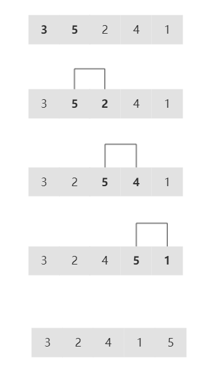
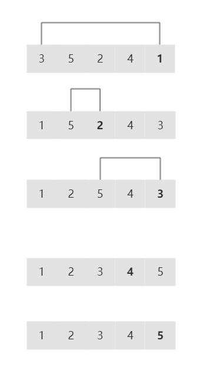
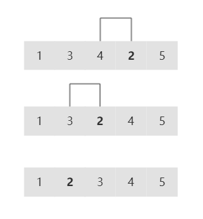
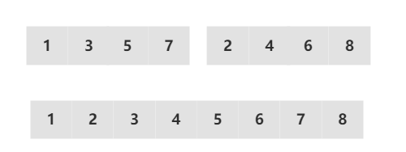

<!-- GFM-TOC -->
* [排序](#排序)
* [查找](#查找)
* [链表](#链表)
* [二叉树](#二叉树)
* [回溯算法](#回溯算法)
* [贪心算法](#贪心算法)
* [动态规划](#动态规划)
<!-- GFM-TOC -->

# 排序
[冒泡排序](#冒泡排序)、[选择排序](#选择排序)、[插入排序](#插入排序)、[希尔排序](#希尔排序)、[归并排序](#归并排序)、[快速排序](#快速排序)

从小到大排序

### 冒泡排序

从左到右不断交换相邻逆序的元素，在一轮的循环之后，可以让未排序的最大元素上浮到右侧。

在一轮循环中，如果没有发生交换，就说明数组已经是有序的，此时可以直接退出。

以下演示了在一轮循环中，将最大的元素 5 上浮到最右侧。

<div align="center">  </div><br>

```c
void bubbleSort(vector<int> &nums) {
    int n = nums.size();
    for (int i = n - 1; i >= 0; --i)
        for (int j = 0; j < i; ++j)
            if (nums[j] > nums[j + 1])
                swap(nums[j], nums[j + 1]);
}
```

### 选择排序

选择出数组中的最小元素，将它与数组的第一个元素交换位置。再从剩下的元素中选择出最小的元素，将它与数组的第二个元素交换位置。不断进行这样的操作，直到将整个数组排序。

选择排序需要 \~N<sup>2</sup>/2 次比较和 \~N 次交换，它的运行时间与输入无关，这个特点使得它对一个已经排序的数组也需要这么多的比较和交换操作。

<div align="center">  </div><br>

```c
void selectSort(vector<int>& nums) {
    int n = nums.size();
    for (int i = 0; i < n; ++i) {
        int min_index = i;
        for (int j = i+1; j < n; ++j) {
            if (nums[j] < nums[min_index])
                min_index = j;
        }
        swap(nums[i], nums[min_index]);
    }
}
```

### 插入排序

每次都将当前元素插入到左侧已经排序的数组中，使得插入之后左侧数组依然有序。

对于数组 {3, 5, 2, 4, 1}，它具有以下逆序：(3, 2), (3, 1), (5, 2), (5, 4), (5, 1), (2, 1), (4, 1)，插入排序每次只能交换相邻元素，令逆序数量减少 1，因此插入排序需要交换的次数为逆序数量。

插入排序的复杂度取决于数组的初始顺序，如果数组已经部分有序了，逆序较少，那么插入排序会很快。

- 平均情况下插入排序需要 \~N<sup>2</sup>/4 比较以及 \~N<sup>2</sup>/4 次交换；
- 最坏的情况下需要 \~N<sup>2</sup>/2 比较以及 \~N<sup>2</sup>/2 次交换，最坏的情况是数组是倒序的；
- 最好的情况下需要 N-1 次比较和 0 次交换，最好的情况就是数组已经有序了。

以下演示了在一轮循环中，将元素 2 插入到左侧已经排序的数组中。

<div align="center">  </div><br>

```c
void insertSort(vector<int>& nums) {
    int n = nums.size();
    for (int i = 1; i < n; ++i) {
        int cur = nums[i];
        int j = i - 1;
        while (j >= 0 && nums[j] > cur) {
            nums[j+1] = nums[j];
            --j;
        }
        nums[j+1] = cur;
    }
}
```

### 归并排序

归并排序的思想是将数组分成两部分，分别进行排序，然后归并起来。

<div align="center">  </div><br>

```c
const int N = 100000;
void merge(vector<int>& vec, int l, int m, int r) {
    int n1 = m - l + 1; // 左边部分
    int n2 = r - m;     // 右边部分

    vector<int> l_vec(n1+1, 0);
    for (int i = 0; i != n1; ++i)
        l_vec[i] = vec[l + i];

    vector<int> r_vec(n2+1, 0);
    for (int i = 0; i != n2; ++i)
        r_vec[i] = vec[m + i + 1];
    
    l_vec[n1] = N; // 结尾加上一个超大的数字
    r_vec[n2] = N;

    int i = 0, j = 0;
    for (int k = l; k <= r; ++k) {
        if(l_vec[i] < r_vec[j])
            vec[k] = l_vec[i++];
        else
            vec[k] = r_vec[j++];
    }
}
void mergeSort(vector<int>& vec, int l, int r) {
    if (l < r) {
        int m = (l+r) / 2;
        mergeSort(vec, l, m);
        mergeSort(vec, m + 1, r);
        merge(vec, l, m, r);
    }
}
void mergeSort(vector<int>& vec) {
    int n = vec.size();
    mergeSort(vec, 0, n - 1);
}
```

### 快速排序

快速排序通过一个切分元素将数组分为两个子数组，左子数组小于等于切分元素，右子数组大于等于切分元素，将这两个子数组排序也就将整个数组排序了。

```c
void quickSort(vector<int>& nums, int lhs, int rhs) {
    if (lhs > rhs) return;
    int i = lhs+1, j = rhs, pivot = nums[lhs];
    while (i < j) {
        while (nums[j] >= pivot && i < j) --j;
        while (nums[i] <= pivot && i < j) ++i;
        if (i < j) swap(nums[i], nums[j]);
    }
    swap(nums[lhs], nums[i]);
    quickSort(nums, lhs, i-1);
    quickSort(nums, i+1, rhs);
}
void quickSort(vector<int>& nums) {
    int n = nums.size();
    quickSort(nums, 0, n-1);
}
```

# 查找

[二分查找](#二分查找)

* 查找和目标值相等的数

```c
int find(vector<int>& nums, int target) {
    int left = 0;
    int right = nums.size();
    while (left < right) {
        int mid = left + (right - left) / 2;
        if (nums[mid] == target) return mid;
        else if (nums[mid] < target) right = mid;
        else left = mid + 1;
    }
    return -1;
}
```

* 查找第一个不小于目标值的数，可变形为查找最后一个小于目标值的数

我们要查找的目标值不一定会在数组中出现，也有可能是跟目标值相等的数在数组中并不唯一，而是有多个，那么这种情况下nums[mid] == target这条判断语句就没有必要存在。

```c
int find(vector<int>& nums, int target) {
    int left = 0;
    int right = nums.size();
    while (left < right) {
        int mid = left + (right - left) / 2;
        if (nums[mid] < target) left = mid + 1;
        else right = mid;
    }
    return right;
}
```

这一类可以轻松的变形为查找最后一个小于目标值的数，怎么变呢。我们已经找到了第一个不小于目标值的数，那么再往前退一位，返回right - 1，就是最后一个小于目标值的数。

* 查找第一个大于目标值的数，可变形为查找最后一个不大于目标值的数

```c
int find(vector<int>& nums, int target) {
    int left = 0; 
    int right = nums.size();
    while (left < right) {
        int mid = left + (right - left) / 2;
        if (nums[mid] <= target) left = mid + 1;
        else right = mid;
    }
    return left;
}
```

这一类可以轻松的变形为查找最后一个不大于目标值的数，怎么变呢。我们已经找到了第一个大于目标值的数，那么再往前退一位，返回right - 1，就是最后一个不大于目标值的数。

* 在排序数组中查找元素的第一个和最后一个位置

[LeetCode34](https://leetcode-cn.com/problems/find-first-and-last-position-of-element-in-sorted-array/)

给定一个按照升序排列的整数数组 nums，和一个目标值 target。找出给定目标值在数组中的开始位置和结束位置。算法时间复杂度必须是 O(log n) 级别。

```c
vector<int> searchRange(vector<int>& nums, int target) {
    vector<int> res(2, -1);
    if (nums.empty())
        return res;
    int left = 0, right = nums.size() - 1;
    while (left < right) {
        int mid = left + (right - left) / 2;
        if (nums[mid] < target)
            left = mid + 1;
        else
            right = mid;
    }
    if (nums[right] != target)
        return res;
    res[0] = right;
    right = nums.size();
    while (left < right) {
        int mid = left + (right - left) / 2;
        if (nums[mid] <= target)
            left = mid + 1;
        else
            right = mid;
    }
    res[1] = left - 1;
    return res;
}
```

# 链表

[反转链表I](#反转链表I)、[反转链表II](#反转链表II)、[环形链表I](#环形链表I)、[环形链表II](#环形链表II)、[删除链表中的重复元素I](#删除链表中的重复元素I)、[删除链表中的重复元素II](#删除链表中的重复元素II)、[删除链表中的节点I](#删除链表中的节点I)、[删除链表中的节点II](#删除链表中的节点II)、[相交链表](#相交链表)、[合并两个有序链表](#合并两个有序链表)、[两两交换链表中的节点](#两两交换链表中的节点)、[K个一组反转链表](#K个一组反转链表)、[分隔链表](#分隔链表)

### 反转链表I

[LeetCode206](https://leetcode-cn.com/problems/reverse-linked-list/)

反转一个单链表。

```c
ListNode* reverseList(ListNode* head) {
    ListNode *pre = nullptr;
    ListNode *cur = head;
    while (cur) {
        ListNode *next = cur->next;
        cur->next = pre;
        pre = cur;
        cur = next;
    }
    return pre;
}
```

### 反转链表II

[LeetCode92](https://leetcode-cn.com/problems/reverse-linked-list-ii/)

反转从位置 m 到 n 的链表。请使用一趟扫描完成反转。

```c
ListNode* reverseBetween(ListNode* head, int m, int n) {
    ListNode *dummy = new ListNode(-1);
    dummy->next = head;
    ListNode *cur = dummy;
    ListNode *pre = nullptr; // 反转段的前一个
    ListNode *front = nullptr; // 反转段反转之后的第一个
    ListNode *last = nullptr; // 反转段反转之后的最后一个
    for (int i = 1; i < m; ++i) cur = cur->next;
    pre = cur;
    last = cur->next;
    for (int i = m; i <= n; ++i) {
        cur = pre->next;
        pre->next = cur->next;
        cur->next = front;
        front = cur;
    }
    cur = pre->next;
    pre->next = front;
    last->next = cur;
    return dummy->next;
}
```

### 环形链表I

[LeetCode141](https://leetcode-cn.com/problems/linked-list-cycle/)

判断链表是否有环。

```c
bool hasCycle(ListNode *head) {
    ListNode *fast = head;
    ListNode *slow = head;
    while (fast && fast->next) {
        fast = fast->next->next;
        slow = slow->next;
        if (fast == slow)
            return true;
    }
    return false;
}
```

### 环形链表II

[LeetCode142](https://leetcode-cn.com/problems/linked-list-cycle-ii/)

给定一个链表，返回链表开始入环的第一个节点。如果链表无环，则返回null。

说明：不允许修改给定的链表。

```c
ListNode *detectCycle(ListNode *head) {
    ListNode *fast = head;
    ListNode *slow = head;
    while (fast && fast->next) {
        fast = fast->next->next;
        slow = slow->next;
        if (fast == slow)
            break;
    }
    if (!fast || !fast->next)
        return nullptr; // 无环
    slow = head;        // 快慢指针相遇时，慢指针回到头节点
    while (slow != fast) {
        slow = slow->next;
        fast = fast->next;
    }
    return slow;
}
```

### 删除链表中的重复元素I

[LeetCode83](https://leetcode-cn.com/problems/remove-duplicates-from-sorted-list/)

给定一个排序链表，删除所有重复的元素，使得每个元素只出现一次。

```c
ListNode *deleteDuplicates(ListNode *head) {
    ListNode *cur = head;
    while (cur && cur->next) {
        if (cur->val == cur->next->val) {
            ListNode *delNode = cur->next;
            cur->next = cur->next->next;
            delete delNode;
            delNode = nullptr;
        }
        else
            cur = cur->next;
    }
    return head;
}
```

### 删除链表中的重复元素II

[LeetCode82](https://leetcode-cn.com/problems/remove-duplicates-from-sorted-list-ii/)

给定一个排序链表，删除所有含有重复数字的节点，只保留原始链表中没有重复出现的数字。

```c
ListNode *deleteDuplicates(ListNode *head) {
    ListNode *dummy = new ListNode(-1);
    dummy->next = head;
    ListNode *pre = dummy;
    ListNode *cur = head;
    while (cur && cur->next) {
        ListNode *next = cur->next;
        if (cur->val == cur->next->val) {
            while (next && next->val == cur->val)
                next = next->next;
            pre->next = next;
            cur = next;
        } else {
            pre = cur;
            cur = next;
        }
    }
    return dummy->next;
}
```

### 删除链表中的节点I

[LeetCode237](https://leetcode-cn.com/problems/delete-node-in-a-linked-list/)

删除某个链表中给定的（非末尾）节点，你将只被给定要求被删除的节点。

```c
void deleteNode(ListNode *node) {
    ListNode *next = node->next;
    node->val = next->val;
    node->next = next->next;
    delete next;
    next = nullptr;
}
```

### 删除链表中的节点II

[LeetCode203](https://leetcode-cn.com/problems/remove-linked-list-elements/)

删除链表中等于给定值 val 的所有节点。

```c
ListNode *removeElements(ListNode *head, int val) {
    ListNode *dummy = new ListNode(-1);
    dummy->next = head;
    ListNode *cur = dummy;
    while (cur && cur->next) {
        if (cur->next->val == val) {
            ListNode *delNode = cur->next;
            cur->next = cur->next->next;
            delete delNode;
            delNode = nullptr;
        }
        else
            cur = cur->next;
    }
    return dummy->next;
}
```

### 相交链表

[LeetCode160](https://leetcode-cn.com/problems/intersection-of-two-linked-lists/)

找到两个单链表相交的起始节点。

```c
ListNode *getIntersectionNode(ListNode *headA, ListNode *headB) {
    ListNode *A = headA;
    ListNode *B = headB;
    while (A != B) { // 走完一条链表再走另一条，相遇即相交点
        A = A ? A->next : headB;
        B = B ? B->next : headA;
    }
    return A;
}
```

### 合并两个有序链表

[LeetCode21](https://leetcode-cn.com/problems/merge-two-sorted-lists/)

将两个有序链表合并为一个新的有序链表并返回。新链表是通过拼接给定的两个链表的所有节点组成的。 

```c
ListNode *mergeTwoLists(ListNode *l1, ListNode *l2) { // 链表的归并排序的merge过程
    ListNode *dummy = new ListNode(-1);
    ListNode *cur = dummy;
    while (l1 && l2) {
        if (l1->val <= l2->val) {
            cur->next = l1;
            l1 = l1->next;
        } else {
            cur->next = l2;
            l2 = l2->next;
        }
        cur = cur->next;
    }
    cur->next = l1 ? l1 : l2; // 一条链表已经结束，接上另一条剩下的部分
    return dummy->next;
}
```

### 两两交换链表中的节点

[LeetCode24](https://leetcode-cn.com/problems/swap-nodes-in-pairs/)

给定一个链表，两两交换其中相邻的节点，并返回交换后的链表。

```c
ListNode *swapPairs(ListNode *head) {
    ListNode *dummy = new ListNode(-1);
    dummy->next = head;
    ListNode *pre = dummy;    // 反转部分的前一个
    ListNode *l1 = head;      // 反转的第一个节点
    ListNode *l2 = nullptr;   // 反转的第二个节点
    ListNode *next = nullptr; // 反转部分的下一个
    while (l1 && l1->next) {
        l2 = l1->next;
        next = l2->next;
        l2->next = l1;
        l1->next = next;
        pre->next = l2;
        pre = l1;
        l1 = next;
    }
    return dummy->next;
}
```

### K个一组反转链表

[LeetCode25](https://leetcode-cn.com/problems/reverse-nodes-in-k-group/)

给出一个链表，每 k 个节点一组进行翻转，并返回翻转后的链表。

```c
ListNode *reverseKGroup(ListNode *head, int k) {
    ListNode *dummy = new ListNode(-1);
    dummy->next = head;
    ListNode *pre = dummy;
    ListNode *cur = dummy;
    int size{0};
    while (cur->next) {
        cur = cur->next;
        ++size;
    }
    while (size >= k) {
        cur = pre->next;
        for (int i = 1; i < k; ++i) {
            ListNode *temp = cur->next;
            cur->next = temp->next;
            temp->next = pre->next;
            pre->next = temp;
        }
        pre = cur;
        size -= k;
    }
    return dummy->next;
}
```

### 分隔链表

[LeetCode86](https://leetcode-cn.com/problems/partition-list/)

给定一个链表和一个特定值 x，对链表进行分隔，使得所有小于 x 的节点都在大于或等于 x 的节点之前。

```c
ListNode *partition(ListNode *head, int x) {
    ListNode *dummy = new ListNode(-1); // 原链表的虚假头节点
    dummy->next = head;
    ListNode *res = new ListNode(-1); // 最终链表的虚假头节点
    ListNode *cur = dummy;
    ListNode *pre = res;
    while (cur->next) {
        if (cur->next->val < x) { // 小于x的节点组成一个小值链表
            pre->next = cur->next;
            pre = pre->next;
            cur->next = cur->next->next;
            pre->next = nullptr;
        }
        else
            cur = cur->next;
    }
    pre->next = dummy->next;
    return res->next;
}
```

# 二叉树

[前序遍历](#前序遍历)、[中序遍历](#中序遍历)、[后序遍历](#后序遍历)、[层序遍历](#层序遍历)、[翻转二叉树](#翻转二叉树)、[二叉搜索树的最近公共祖先](#二叉搜索树的最近公共祖先)、[二叉树的最近公共祖先](#二叉树的最近公共祖先)、[二叉树的最大深度](#二叉树的最大深度)、[二叉树的最小深度](#二叉树的最小深度)、[平衡二叉树](#平衡二叉树)、[二叉树的右视图](#二叉树的右视图)、[二叉树的下一个节点](#二叉树的下一个节点)

### 前序遍历

[LeetCode144](https://leetcode-cn.com/problems/binary-tree-preorder-traversal/)

* 递归

```c
class Solution {
public:
    vector<int> preorderTraversal(TreeNode* root) {
        vector<int> res;
        preOrder(root, res);
        return res;
    }
    void preOrder(TreeNode* root, vector<int>& res) {
        if (!root) return;
        res.push_back(root->val);
        preOrder(root->left, res);
        preOrder(root->right, res);
    }
};
```

* 非递归，用栈

```c
class Solution {
public:
    vector<int> preorderTraversal(TreeNode* root) {
        vector<int> res;
        if (!root) return res;
        stack<TreeNode*> s;
        s.push(root);
        while (!s.empty()) {
            TreeNode *t = s.top();
            s.pop();
            res.push_back(t->val);
            if (t->right) s.push(t->right); // 先压入右孩子
            if (t->left) s.push(t->left);   // 后压入左孩子，左孩子才能先出
        }
        return res;
    }
};
```

### 中序遍历

[LeetCode94](https://leetcode-cn.com/problems/binary-tree-inorder-traversal/)

* 递归

```c
class Solution {
public:
    vector<int> inorderTraversal(TreeNode* root) {
        vector<int> res;
        if (!root) return res;
        inOrder(root, res);
        return res;
    }
    void inOrder(TreeNode* root, vector<int>& res) {
        if (!root) return;
        inOrder(root->left, res);
        res.push_back(root->val);
        inOrder(root->right, res);
    }
};
```

* 非递归

```c
class Solution {
public:
    vector<int> inorderTraversal(TreeNode* root) {
        vector<int> res;
        stack<TreeNode*> s;
        TreeNode *cur = root; // 不改变传入的指针
        while (!s.empty() || cur) {
            if (cur) { // 每一棵子树都必须找到最左的孩子
                s.push(cur);
                cur = cur->left;
            } else {
                TreeNode *t = s.top();
                s.pop();
                res.push_back(t->val);
                cur = t->right;
            }
        }
        return res;
    }
};
```

* Morris Traversal，不用栈，空间复杂度O（1）

```c
class Solution {
public:
    vector<int> inorderTraversal(TreeNode* root) {
        vector<int> res;
        if (!root) return res;
        TreeNode *cur = root;
        TreeNode *pre = nullptr;
        while (cur) {
            if (!cur->left) {
                res.push_back(cur->val);
                cur = cur->right;
            } else {
                pre = cur->left;
                while (pre->right && pre->right != cur) pre = pre->right;
                if (!pre->right) {
                    pre->right = cur;
                    cur = cur->left;
                } else {
                    pre->right = nullptr;
                    res.push_back(cur->val);
                    cur = cur->right;
                }
            }
        }
        return res;
    }
};
```

### 后序遍历

[LeetCode145](https://leetcode-cn.com/problems/binary-tree-postorder-traversal/)

* 递归

```c
class Solution {
public:
    vector<int> postorderTraversal(TreeNode* root) {
        vector<int> res;
        if (!root) return res;
        postOrder(root, res);
        return res;
    }
    void postOrder(TreeNode* root, vector<int>& res) {
        if (!root) return;
        postOrder(root->left, res);
        postOrder(root->right, res);
        res.push_back(root->val);
    }
};
```

* 非递归，用栈，首先如果栈顶元素如果没有左右子结点的话，说明其是叶结点，而且我们的入栈顺序保证了左子结点先被处理，所以此时的结点值就可以直接加入结果res了，然后移出栈，将head指向这个叶结点，这样的话head每次就是指向前一个处理过并且加入结果res的结点，那么如果栈顶结点的左子结点或者右子结点是head的话，说明其子结点已经加入结果res了，那么就可以处理当前结点了

```c
class Solution {
public:
    vector<int> postorderTraversal(TreeNode* root) {
        vector<int> res;
        if (!root) return res;
        stack<TreeNode*> s{{root}};
        TreeNode *head = root;
        while (!s.empty()) {
            TreeNode *t = s.top();
            if ((!t->left && !t->right) || // 栈顶元素是叶结点，入栈顺序保证了左子结点先被处理，所以此时的结点值就可以直接加入结果res
                t->left == head ||         // 子结点已经加入结果res了，那么就可以处理当前结点了
                t->right == head) 
            {
                res.push_back(t->val);
                s.pop();
                head = t; // head每次就是指向前一个处理过并且加入结果res的结点
            } else {
                if (t->right) s.push(t->right);
                if (t->left) s.push(t->left);
            }
        }
        return res;
    }
};
```

* 非递归，用栈，前序遍历方法修改而来

```c
class Solution {
public:
    vector<int> postorderTraversal(TreeNode* root) {
        vector<int> res;
        if (!root) return res;
        stack<TreeNode*> s;
        s.push(root);
        while (!s.empty()) {
            TreeNode *t = s.top();
            s.pop();
            res.insert(res.begin(), t->val); // 插入操作的复杂度太高，不建议使用
            if (t->left) s.push(t->left);
            if (t->right) s.push(t->right);
        }
        return res;
    }
};
```

### 层序遍历

[LeetCode102](https://leetcode-cn.com/problems/binary-tree-level-order-traversal/)

* 非递归，用队列

```c
class Solution {
public:
    vector<vector<int>> levelOrder(TreeNode* root) {
        vector<vector<int>> res;
        if (!root) return res;
        queue<TreeNode*> q;
        q.push(root);
        while (!q.empty()) {
            vector<int> vec;
            int n = q.size();
            for (int i = 0; i < n; ++i) {
                TreeNode *t = q.front();
                q.pop();
                vec.push_back(t->val);
                if (t->left) q.push(t->left);
                if (t->right) q.push(t->right);
            }
            res.push_back(vec);
        }
        return res;
    }
};
```

### 翻转二叉树

[LeetCode226](https://leetcode-cn.com/problems/invert-binary-tree/)

* 递归

```c
class Solution {
public:
    TreeNode* invertTree(TreeNode* root) {
        if (!root) return nullptr;
        swap(root->left, root->right);
        invertTree(root->left);
        invertTree(root->right);
        return root;
    }
};
```

* 非递归，队列，层序

```c
class Solution {
public:
    TreeNode* invertTree(TreeNode* root) {
        if (!root) return nullptr;
        queue<TreeNode*> q;
        q.push(root);
        while (!q.empty()) {
            TreeNode *t = q.front();
            q.pop();
            swap(t->left, t->right);
            if (t->left) q.push(t->left);
            if (t->right) q.push(t->right);
        }
        return root;
    }
};
```

### 二叉搜索树的最近公共祖先

[LeetCode235](https://leetcode-cn.com/problems/lowest-common-ancestor-of-a-binary-search-tree/)

最近公共祖先的定义为：“对于有根树 T 的两个结点 p、q，最近公共祖先表示为一个结点 x，满足 x 是 p、q 的祖先且 x 的深度尽可能大（一个节点也可以是它自己的祖先）。”

* 递归

```c
class Solution {
public:
    TreeNode* lowestCommonAncestor(TreeNode* root, TreeNode* p, TreeNode* q) {
        if (!root) return nullptr;
        if (p->val < root->val && q->val < root->val)
            return lowestCommonAncestor(root->left, p, q);
        if (p->val > root->val && q->val > root->val)
            return lowestCommonAncestor(root->right, p, q);
        return root;
    }
};
```

* 非递归

```c
class Solution {
public:
    TreeNode* lowestCommonAncestor(TreeNode* root, TreeNode* p, TreeNode* q) {
        while (true) {
            if (p->val < root->val && q->val < root->val)
                root = root->left;
            else if (p->val > root->val && q->val > root->val)
                root = root->right;
            else break;
        }
        return root;
    }
};
```

### 二叉树的最近公共祖先

[LeetCode236](https://leetcode-cn.com/problems/lowest-common-ancestor-of-a-binary-tree/)

若p和q要么分别位于左右子树中，那么对左右子结点调用递归函数，会分别返回p和q结点的位置，而当前结点正好就是p和q的最小共同父结点，直接返回当前结点即可。若p和q同时位于左子树，这里有两种情况，一种情况是left会返回p和q中较高的那个位置，而right会返回空，所以我们最终返回非空的left即可，这就是题目中的例子2的情况。还有一种情况是会返回p和q的最小父结点，就是说当前结点的左子树中的某个结点才是p和q的最小父结点，会被返回。若p和q同时位于右子树，同样这里有两种情况，一种情况是right会返回p和q中较高的那个位置，而left会返回空，所以我们最终返回非空的right即可，还有一种情况是会返回p和q的最小父结点，就是说当前结点的右子树中的某个结点才是p和q的最小父结点，会被返回。

```c
class Solution {
public:
    TreeNode* lowestCommonAncestor(TreeNode* root, TreeNode* p, TreeNode* q) {
        if (!root || p == root || q == root) return root;
        TreeNode *left = lowestCommonAncestor(root->left, p, q);
        TreeNode *right = lowestCommonAncestor(root->right, p, q);
        if (left && right) return root; // 若p和q分别位于左右子树中，那么会分别返回p和q结点的位置，而当前结点就是最小共同父结点
        return left ? left : right; // p和q同时位于左子树，或者p和q同时位于右子树
    }
};
```

### 二叉树的最大深度

* 递归

```c
class Solution {
public:
    int maxDepth(TreeNode* root) {
        if (!root) return 0;
        return 1 + max(maxDepth(root->left), maxDepth(root->right));
    }
};
```

* 层序遍历，层数

```c
class Solution {
public:
    int maxDepth(TreeNode* root) {
        if (!root) return 0;
        queue<TreeNode*> q{{root}};
        int res{0};
        while (!q.empty()) {
            int n = q.size();
            TreeNode *node = nullptr;
            for (int i = 0; i < n; ++i) {
                node = q.front();
                q.pop();
                if (node->left) q.push(node->left);
                if (node->right) q.push(node->right);
            }
            ++res;
        }
        return res;
    }
};
```

### 二叉树的最小深度

* 递归，讨论五种情况：节点自身为空，节点为叶节点，节点无左子树，节点无右子树，节点左右子树都有

```c
class Solution {
public:
    int minDepth(TreeNode* root) {
        if (!root) return 0;
        if (!root->left && !root->right) // 叶子结点就返回这一层高度是1
            return 1;
        if (!root->left) // 没有左子树
            return minDepth(root->right) + 1;
        else if (!root->right) // 没有右子树
            return minDepth(root->left) + 1;
        else  // 左右子树都有
            return 1 + min(minDepth(root->left), minDepth(root->right));
    }
};
```

* 层序遍历，遇到第一个叶子结点的那一层就是最小深度

```c
class Solution {
public:
    int minDepth(TreeNode* root) {
        if (!root) return 0;
        queue<TreeNode*> q{{root}};
        int res{0};
        while (!q.empty()) {
            ++res;
            int n = q.size();
            TreeNode *node = nullptr;
            for (int i = 0; i < n; ++i) {
                node = q.front();
                q.pop();
                if (!node->left && !node->right) return res; // 遇到叶子结点就返回
                if (node->left) q.push(node->left);
                if (node->right) q.push(node->right);
            }
        }
        return res;
    }
};
```

### 平衡二叉树

```c

```

### 二叉树的右视图

```c

```

### 二叉树的下一个节点

```c

```

# 回溯算法

[全排列](#全排列)、[组合](#组合)、[小岛的个数](#小岛的个数)

深度优先搜索

### 全排列

```c

```

### 组合

```c

```

### 小岛的个数

```c

```

# 贪心算法

[分发饼干](#分发饼干)

```c

```

# 动态规划

[斐波那契数列](#斐波那契数列)、[最长上升子序列](#最长上升子序列)、[最长公共子序列](#最长公共子序列)、[最长公共子串](#最长公共子串)

### 斐波那契数列

```c

```

### 最长上升子序列

```c

```

### 最长公共子序列

```c

```

### 最长公共子串

```c

```
